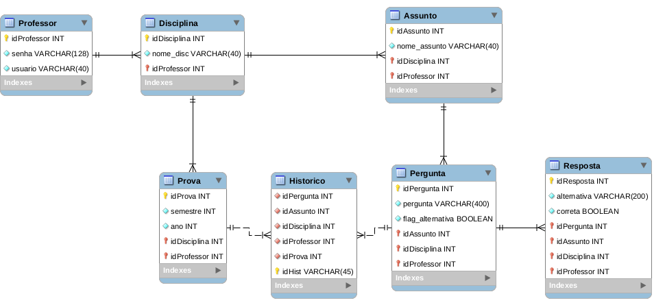

# Projeto 2

* Este projeto foi implementado utilizando a Python3, Flask, SQLite e SQLAlchemy, Flask-SQLAlchemy e Flask-WTF

## Passos para executar o projeto:
* Abrir utilizando PyCharm, IDE para projetos feitos em Python
* Executar o projeto a partir da IDE
* A execução gera um link, para abrir o site gerado nesse projeto basta abrir esse link em um navegador

## Modelagem do banco de dados
A imagem abaixo apresenta a modelagem do banco de dados feita para atender os requisitos do projeto.

